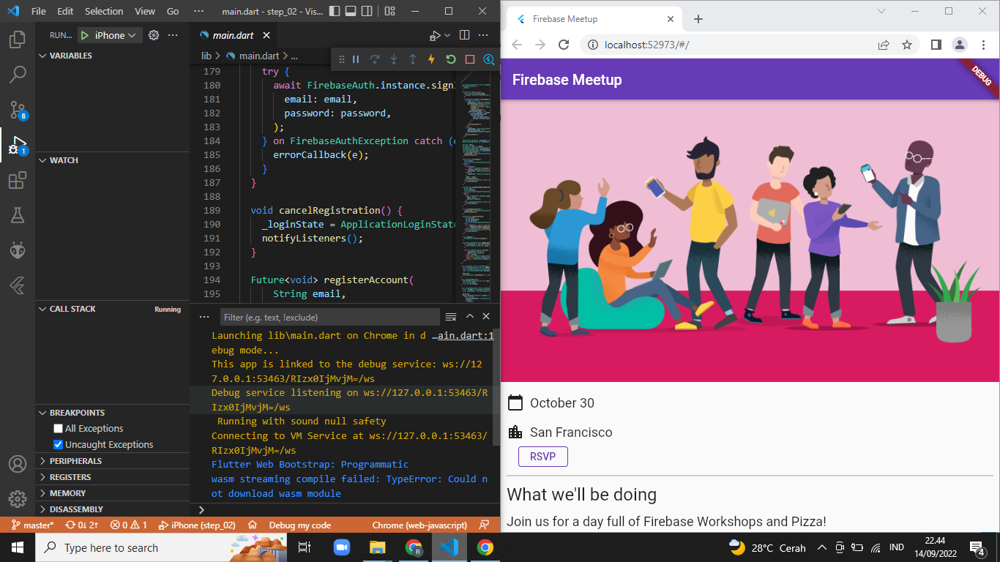
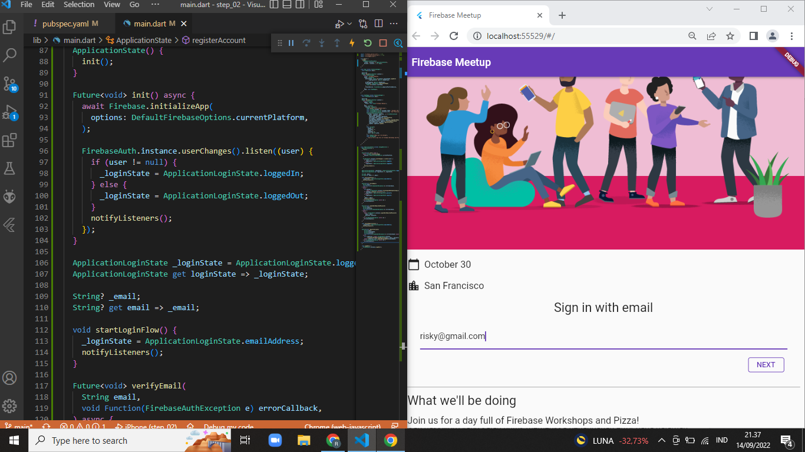
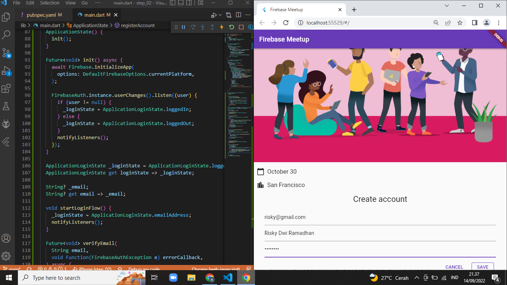
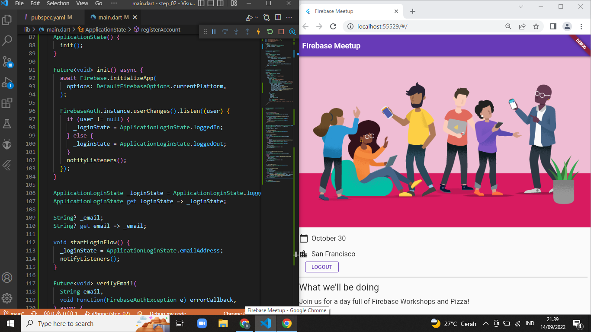
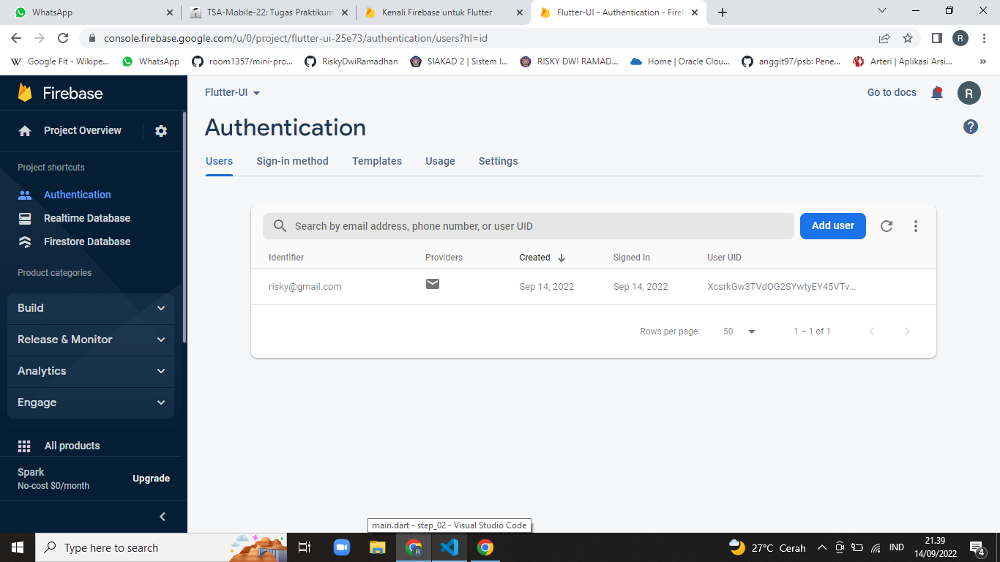
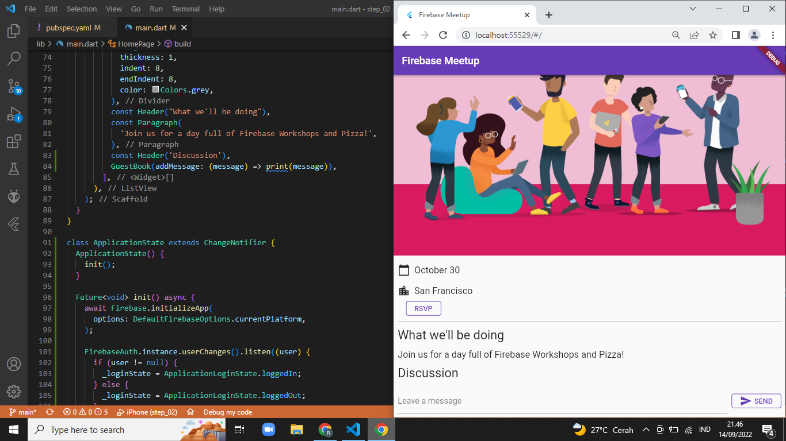
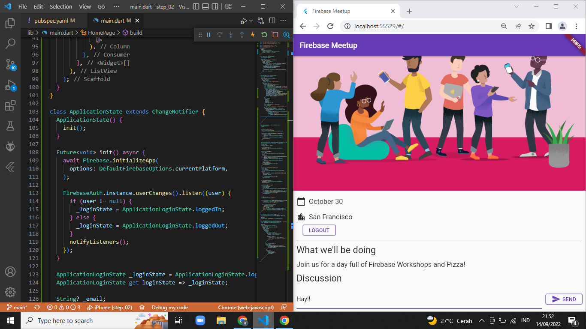
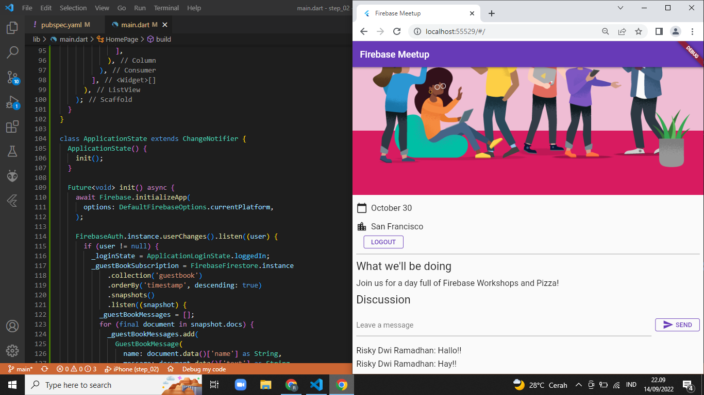
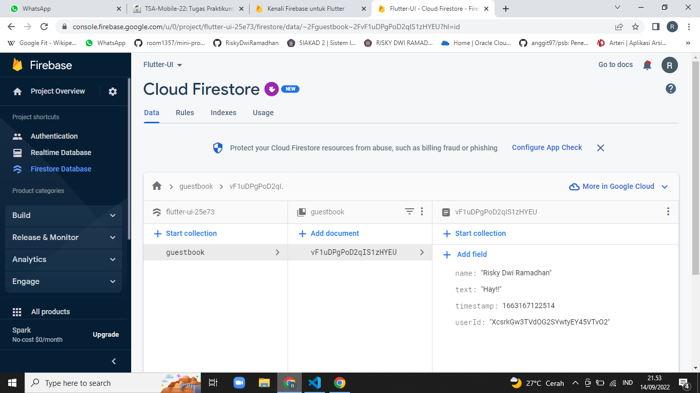

# Get to know Firebase for Flutter codelab

## Membuat Login dan Register

## Data User Tersimpan Di Database Firebase

## Menambahkan Form Discus

## Data Discus Tersimpan Di Database Firebase
