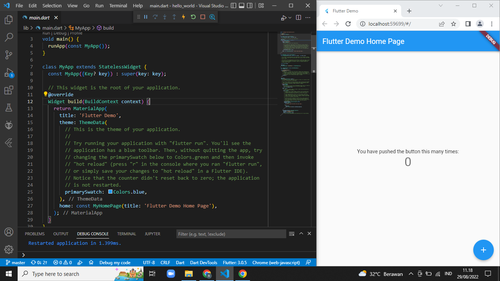
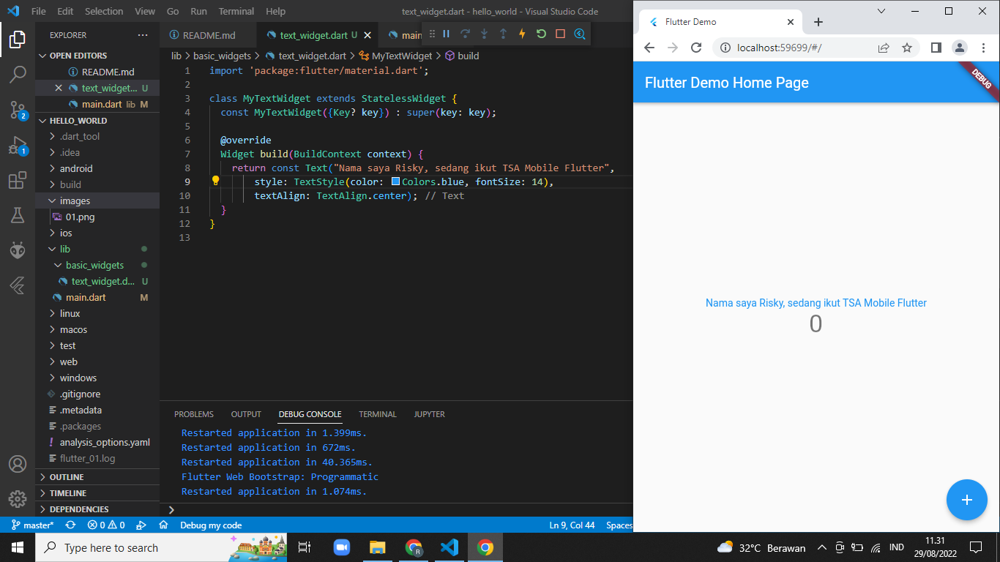
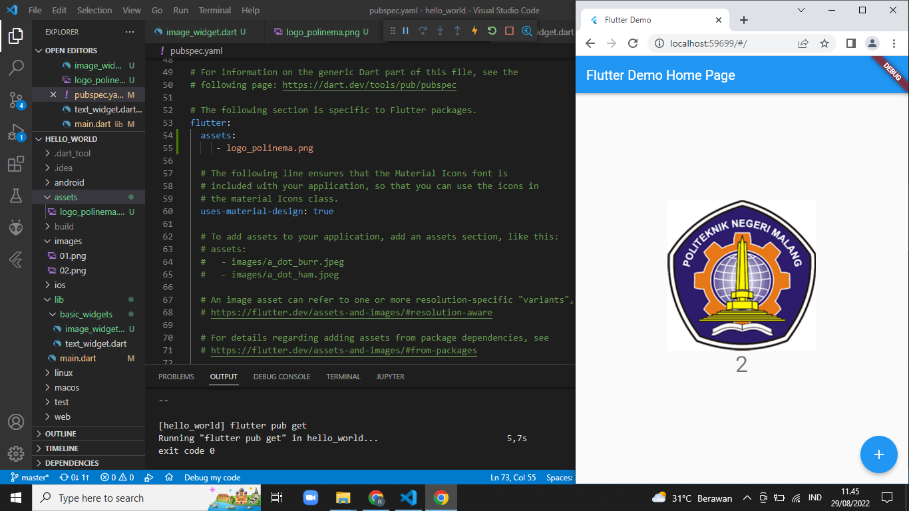
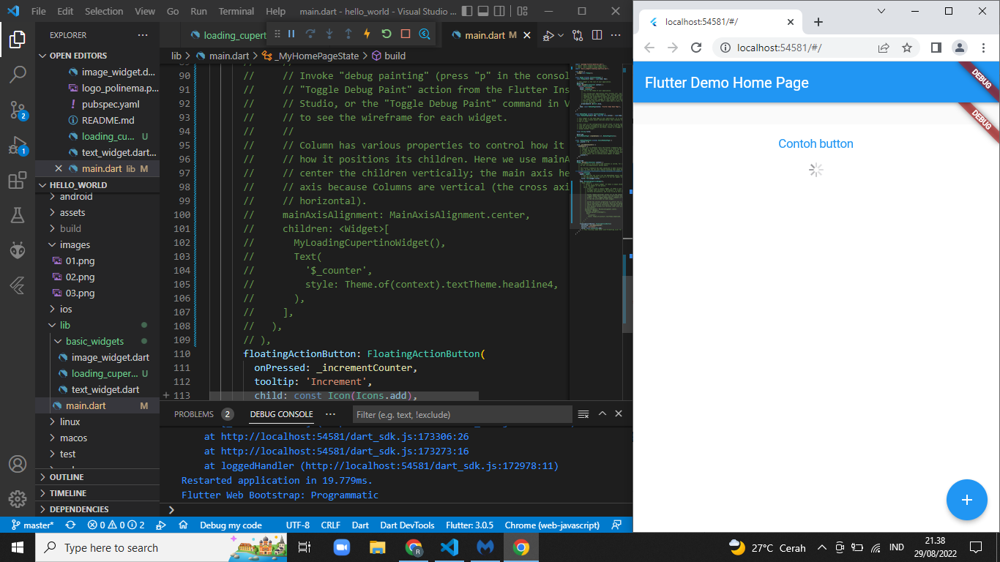
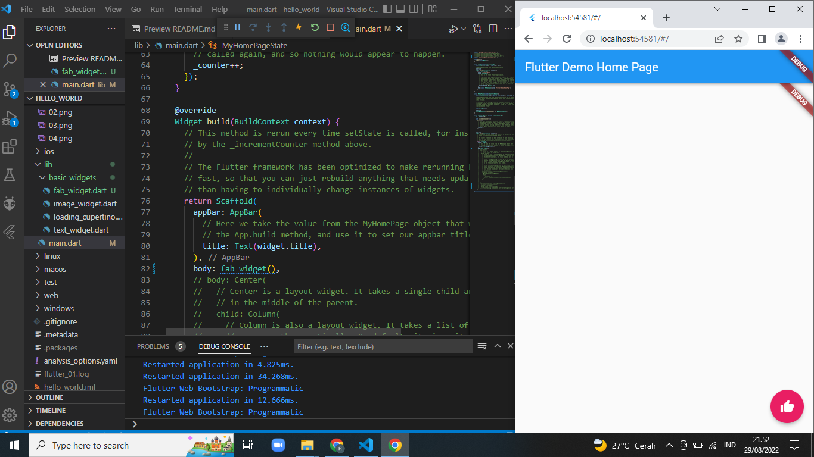
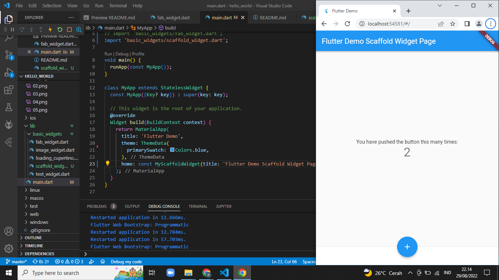

# hello_world

A new Flutter project.

## Menerapkan Widget Dasar
### Text Widget

### Image Widget

## Menerapkan Widget Material Design dan iOS Cupertino
### Cupertino Button dan Loading Bar

### Floating Action Button (FAB)

### Scaffold Widget

