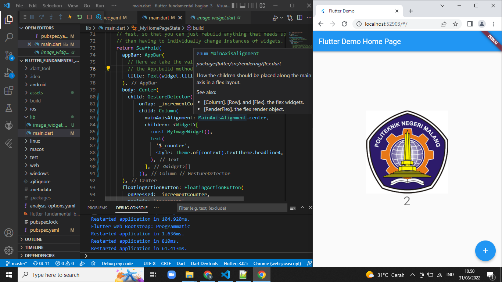
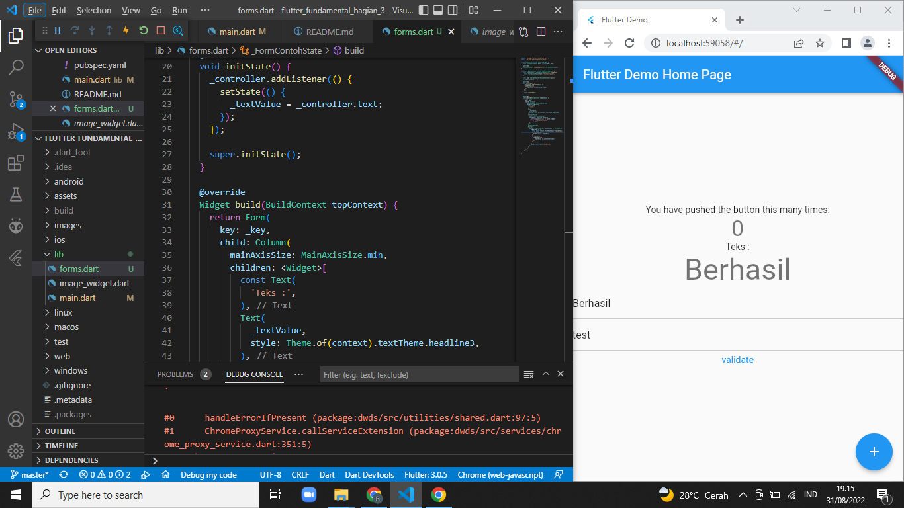

# 18 flutter_fundamental_bagian_3

## Praktikum 1: Menerapkan Gesture Detector
## GestureDetector

## Eksperimen Jenis Gesture Lain
Tampilan yang didapat sama saja tetapi perbedaanya ada pada proses GestureDetector yaitu:
1. onTap itu diproses ketika widget ditekan sekali.
2. onDoubleTap itu diproses ketika widget ditekan duakali.
3. onLongPress itu diproses ketika widget ditekan lama(beberapa detik).
## Praktikum 2: Menerapkan Input Widget dan Forms
