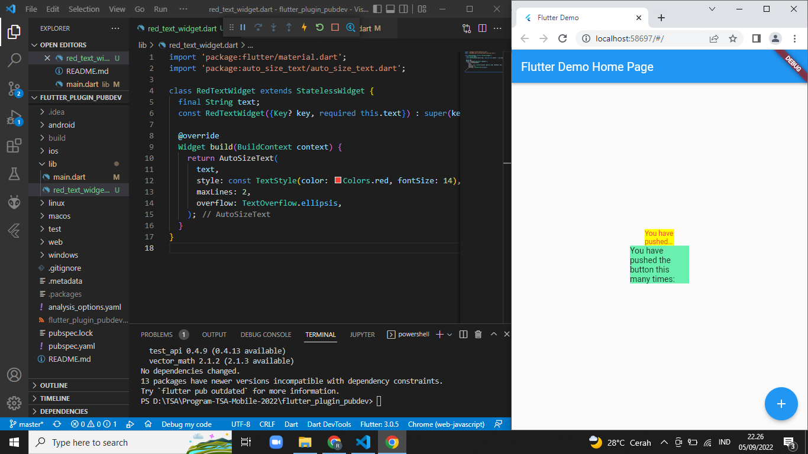

# flutter_plugin_pubdev

## Tugas Praktikum
1. Selesaikan Praktikum tersebut, lalu dokumentasikan dan push ke repository Anda berupa screenshot hasil pekerjaan beserta penjelasannya di file README.md!

2. Jelaskan maksud dari langkah 2 pada praktikum tersebut!  
**Jawab:** Pada langkah 2 ini yaitu menambahkan plugin yang dibutuhkan yaitu auto_size_text
3. Jelaskan maksud dari langkah 5 pada praktikum tersebut! 
**Jawab:** Pada langkah 4 masih terjadi error karena variable text masih belum didevinisikan dan menambahkan parameter text sebagai required(harus ada textnya).
4. Pada langkah 6 terdapat dua widget yang ditambahkan, jelaskan fungsi dan perbedaannya! 
**Jawab:** pada widget pertama yaitu memanggil RedTextWidget yang telah menggimplemantasi auto_size_text dengan background kuning dan panjang 50, sedangakan untuk widget ke 2 yaitu dia memanggil text biasa dengan background hijau dan panjang 100. 
5. Jelaskan maksud dari tiap parameter yang ada di dalam plugin auto_size_text berdasarkan tautan pada dokumentasi ini ! 
**Jawab:** Penjelasan dari tiap parameter tersebut seperti berikut ini:
- key : Mengontrol bagaimana satu widget menggantikan widget lain di pohon
- textKey : Setel kunci untuk Textwidget yang dihasilkan
- style : Jika bukan nol, gaya yang digunakan untuk teks ini
- minFontSize : Batasan ukuran teks minimum yang akan digunakan saat mengubah ukuran teks secara otomatis.
Diabaikan jika presetFontSizesdisetel.
- maxFontSize : Batasan ukuran teks maksimum yang akan digunakan saat mengubah ukuran teks secara otomatis.Diabaikan jika presetFontSizesdisetel.
- stepGranularity : Ukuran langkah di mana ukuran font sedang disesuaikan dengan batasan.
- presetFontSizes : Mendefinisikan semua ukuran font yang mungkin. Penting: presetFontSizes harus dalam urutan menurun.
- group : Menyinkronkan ukuran beberapa AutoSizeTexts
- textAlign : Bagaimana teks harus disejajarkan secara horizontal.
- textDirection : Arah teks. Ini memutuskan bagaimana textAlignnilai disukai TextAlign.startdan TextAlign.enddiinterpretasikan.
- locale : Digunakan untuk memilih font ketika karakter Unicode yang sama dapat dirender secara berbeda, tergantung pada lokal.
- softWrap : Apakah teks harus putus pada jeda baris lunak.
- wrapWords : Apakah kata-kata yang tidak cocok dalam satu baris harus dibungkus. Default untuk trueberperilaku seperti Text.
- overflow : Bagaimana visual overflow harus ditangani.
- overflowReplacement : Jika teks meluap dan tidak sesuai dengan batasnya, widget ini akan ditampilkan sebagai gantinya.
- textScaleFactor : Jumlah piksel font untuk setiap piksel logis. Juga mempengaruhi minFontSize, maxFontSizedan presetFontSizes.
- maxLines : Jumlah maksimum baris opsional untuk teks yang akan dibentangkan.
- semanticsLabel : Label semantik alternatif untuk teks ini.