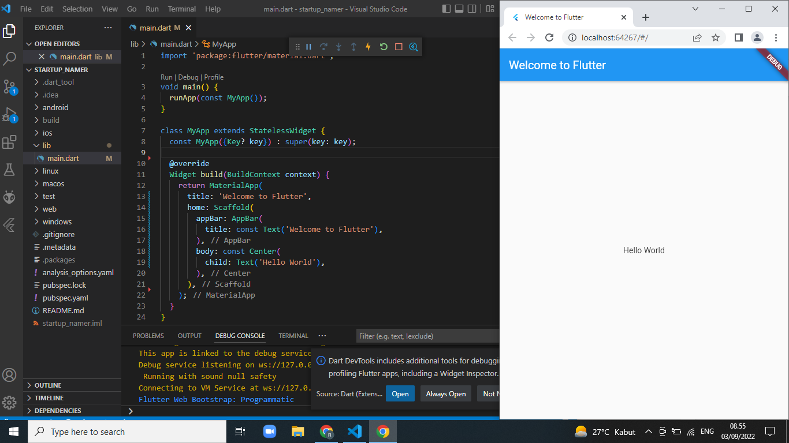
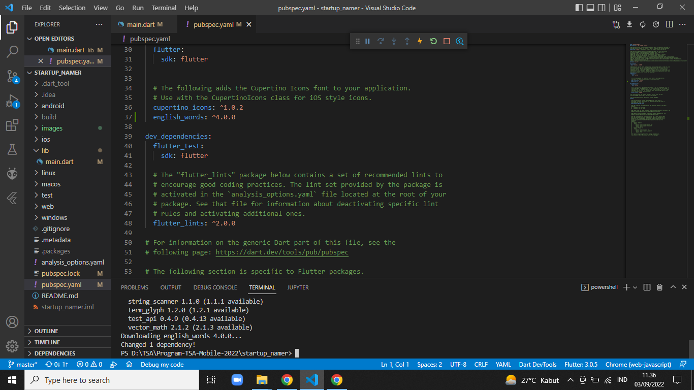
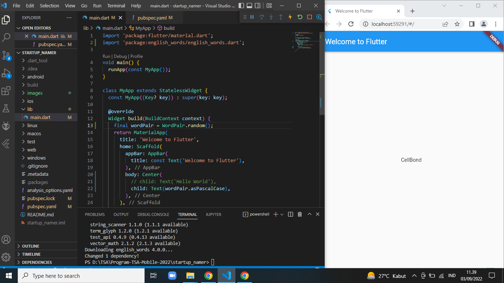
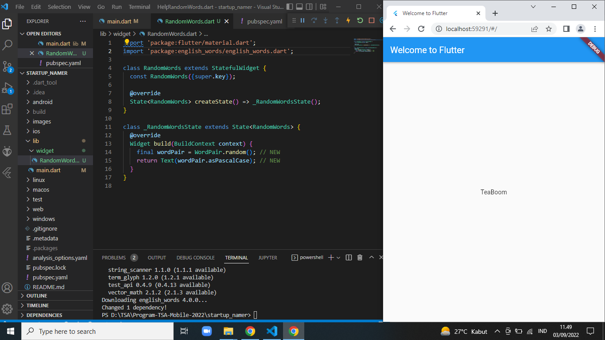
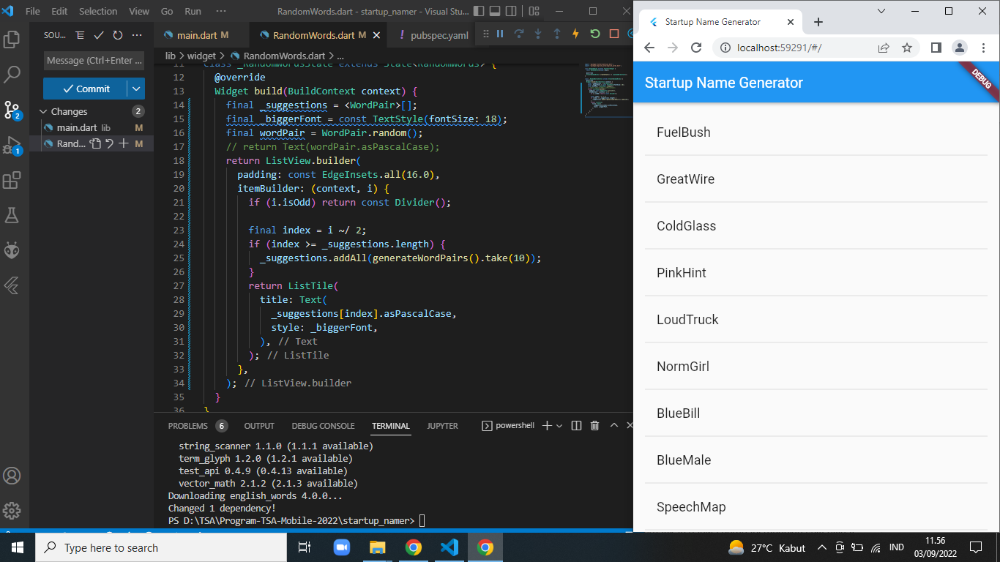

# startup_namer

## Praktikum 1: Membuat Project Flutter Awal

## Praktikum 2: Cara Menggunakan paket eksternal
Menambahkan dependensi 'english_words' kedalam file pubspec.yaml

Menggunakan Paket external

## Praktikum 3: Tambahkan widget stateful

## Praktikum 4: Menambahkan Listview dengan 'RandomWords'
